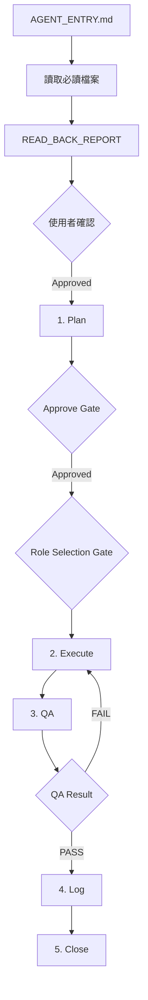

# 🤖 Agent Workflow Template

> AI Agent 多角色協作開發工作流程系統

[](../../generate)
[](https://opensource.org/licenses/MIT)

## ✨ 特色

- ✅ **7-Stage Workflow** - Plan → Approve → Role Selection → Execute → QA → Log → Close
- ✅ **4 核心角色** - Planner, Domain Expert, Engineer, QA
- ✅ **Skills 系統** - Code Review, Doc Generation, Test Runner
- ✅ **VS Code 原生整合** - terminal.sendText + Proposed API 監測 (v1.2.0 更新)
- ✅ **Gate System** - 多重審核閘門防止失控執行
- ✅ **Scope Break** - 範圍中斷機制
- ✅ **繁體中文** - 完整中文化文件

## 🚀 快速開始

### 1. 使用此 Template

點擊右上角綠色按鈕 **"Use this template"** → **"Create a new repository"**

### 2. Clone 到本地

```bash
git clone https://github.com/YOUR_USERNAME/YOUR_NEW_REPO.git
cd YOUR_NEW_REPO
```

### 3. 客製化專案

```bash
# 編輯專案規則（重要！）
nano project_rules.md

# 更新領域專家角色
nano .agent/roles/domain_expert.md

# 建立第一個任務
nano doc/implementation_plan_index.md
```

### 4. 開始使用

在 VS Code 中輸入：
```
/dev-team
```

## 📁 結構說明

```
your-project/
├── .agent/
│   ├── workflows/
│   │   ├── AGENT_ENTRY.md      ← 唯一入口（必讀）
│   │   └── dev-team.md         ← 4 角色團隊流程
│   ├── roles/
│   │   ├── planner.md          ← 規劃師
│   │   ├── domain_expert.md    ← 領域專家（需客製）
│   │   ├── engineer.md         ← 工程師
│   │   └── qa.md               ← 品管員
│   ├── skills/
│   │   ├── code_reviewer.py    ← 代碼審查
│   │   ├── doc_generator.py    ← 文件生成
│   │   ├── test_runner.py      ← 測試執行
│   │   ├── explore_cli_tool.md ← CLI 工具探索 SOP
│   │   └── SKILL.md            ← 技能系統說明
│   ├── scripts/
│   │   └── setup_workflow.sh   ← 移植腳本
│   └── PORTABLE_WORKFLOW.md    ← 移植指南
├── doc/
│   ├── plans/                  ← 開發計畫
│   │   └── Idx-000_plan.template.md
│   └── implementation_plan_index.md  ← 任務索引
└── project_rules.md            ← 專案規則（需填寫）
```

## 🔄 Workflow 流程圖



## 📚 文件

- [PORTABLE_WORKFLOW.md](.agent/PORTABLE_WORKFLOW.md) - 移植指南
- [AGENT_ENTRY.md](.agent/workflows/AGENT_ENTRY.md) - 工作流程詳解
- [dev-team.md](.agent/workflows/dev-team.md) - 團隊協作流程
- [SKILL.md](.agent/skills/SKILL.md) - 技能系統說明

## 🔧 客製化清單

- [ ] 編輯 `project_rules.md` - 填入專案架構、技術棧
- [ ] 編輯 `.agent/roles/domain_expert.md` - 定義領域專家職責
- [ ] 更新 `README.md` - 加入專案特定資訊
- [ ] 建立 `.env.example` - 環境變數範例
- [ ] 設定 `.gitignore` - 忽略敏感檔案

## 🎯 適用場景

- ✅ 新專案開發（Web, API, Data Pipeline）
- ✅ 多人協作專案
- ✅ 需要嚴格代碼審查的專案
- ✅ 需要 AI Agent 輔助開發的專案

## 🛠️ 核心功能

### Gate System（閘門系統）
- **READ_BACK_REPORT Gate**: 確保已讀取所有必要文件
- **Approve Gate**: 使用者審核 Plan
- **Role Selection Gate**: 選擇 Executor 和 QA（角色分離）

### Scope Break（範圍中斷）
當執行中出現 Plan 未包含的新需求時：
1. 立即停止
2. 回報 `SCOPE BREAK`
3. 詢問使用者決策

### 4 角色分工

| 角色 | 職責 | 產出物 |
|------|------|--------|
| **Planner** | 需求轉規格 | Spec (開發規格書) |
| **Domain Expert** | 專業領域審核 | 審核報告 |
| **Engineer** | 程式碼實作 | 程式碼 + 實作報告 |
| **QA** | 代碼審查 | 品管審查報告 |

## 📖 使用範例

### 啟動開發團隊

```
使用者: /dev-team
```

系統會依序執行：
1. **Planner** 產出 Spec
2. **Domain Expert** 審核專業邏輯
3. **Engineer** 實作程式碼
4. **QA** 審查代碼品質

### 完整流程範例

```markdown
# Step 1: Planner 產出 Spec
## 📄 開發規格書
### 目標
新增使用者登入功能

### 檔案變更
| 檔案 | 動作 | 說明 |
|------|------|------|
| auth/login.py | 新增 | 登入邏輯 |
| ui/login_page.py | 新增 | 登入頁面 |

---

# Step 2: Domain Expert 審核
## 📊 領域專家審核
### 結論
✅ 通過 - 認證邏輯符合安全規範

---

# Step 3: Engineer 實作
## 🔧 實作報告
已完成檔案：
- auth/login.py
- ui/login_page.py

---

# Step 4: QA 審查
## ✅ 品管審查報告
### Checklist
- [x] 無 Hard-code API Key
- [x] 有中文檔案註釋
- [x] 符合 project_rules.md

### 結論
🟢 通過
```

## 🔐 安全規範

- **絕對禁止**: Hard-code API Key / Password / Token
- **強制規範**: 使用 `.env` 環境變數
- **檔案長度**: 主程式 ≤ 600 行，業務邏輯 ≤ 400 行

## 🤝 貢獻

歡迎提交 Issue 或 Pull Request 改進此 Template！

## 📝 License

MIT License - 自由使用與修改

## 📧 聯絡

有問題？歡迎開 [Issue](../../issues) 或 [Discussion](../../discussions)

---

**⭐ 如果這個 Template 對你有幫助，請給個 Star！**
