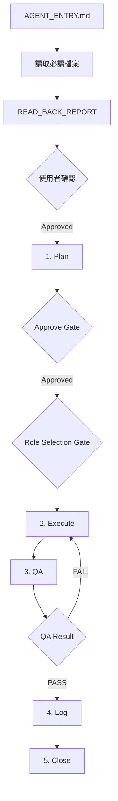

# 🤖 Agent Workflow Template

> AI Agent 多角色協作開發工作流程系統

[](https://opensource.org/licenses/MIT)

## ✨ 特色

- ✅ **7-Stage Workflow** - Plan → Approve → Role Selection → Execute → QA → Log → Close
- ✅ **5 核心角色** - Planner, Domain Expert, Security Reviewer, Engineer, QA
- ✅ **Skills 系統** - Project Planner, Deep Research, Fact Checker, Code Review, Refactor, TypeScript Expert, Python Expert, Doc Generation, Test Runner
- ✅ **VS Code Terminal PTY 主路徑** - PTY send / submit / monitor，fallback 僅在同意後啟用
- ✅ **Gate System** - 多重審核閘門防止失控執行
- ✅ **Scope Break** - 範圍中斷機制
- ✅ **繁體中文** - 完整中文化文件

## 🚀 快速開始

### 1. 建立或準備下游專案 Repo

建立新的空 repo，或準備一個既有 repo 作為 downstream overlay。

### 2. 用 core/overlay 方式導入 workflow core

```bash
git clone https://github.com/YOUR_USERNAME/YOUR_NEW_REPO.git
cd YOUR_NEW_REPO
```

唯一推薦的 downstream 建專案方式是：

1. 先用 [.agent/PORTABLE_WORKFLOW.md](.agent/PORTABLE_WORKFLOW.md) 完成第一次 bootstrap，建立 root live paths 與 project overlay
2. 後續 upstream 更新只走 `workflow-core` release/sync lane，不再使用 GitHub `Use this template` 複製整包 repo
3. `maintainers/`、template-only helper、mutable/generated path 都不屬於 downstream canonical surface

另外，curated core 會額外帶出 `project_maintainers/chat/` 與 `project_maintainers/improvement_candidates/` skeleton，作為 downstream 專案自己的 handoff / archive / promotion-candidate supporting surface；它和 template repo 自己的 `maintainers/` 是兩套不同用途的目錄。

> `Use this template` 不再是推薦的 downstream 建專案方式，因為它會複製整個 repository，與目前已定下的 curated core + overlay 邊界不一致。

## 🧠 角色技能載入對照表

為了讓 Gate 規格與執行規格一致，角色在實際執行前應依條件載入對應技能：

| 角色 | 何時載入 | 必要技能 / 命令 |
|------|----------|----------------|
| **Planner** | 任務需要 milestones、phases、dependency、估時或風險盤點 | `cat .agent/skills/project-planner/SKILL.md`<br>`cat .agent/skills/project-planner/references/planning-framework.md`<br>`cat .agent/skills/project-planner/references/task-sizing-and-dependencies.md`<br>`cat .agent/skills/project-planner/references/estimation-and-risk.md` |
| **Coordinator** | 命中 [Coordinator Research Skill Trigger Checklist](.agent/workflows/references/coordinator_research_skill_trigger_checklist.md) | 依 checklist 載入：<br>`cat .agent/skills/deep-research/SKILL.md`<br>`cat .agent/skills/deep-research/references/research-process.md`<br>`cat .agent/skills/deep-research/references/source-policy-and-output.md`<br>若 checklist 同時命中 `fact-checker` 類型，再加：<br>`cat .agent/skills/fact-checker/SKILL.md`<br>`cat .agent/skills/fact-checker/references/verification-process.md`<br>`cat .agent/skills/fact-checker/references/verdict-and-context.md` |
| **Engineer** | 命中 [Engineer Skill Trigger Checklist](.agent/workflows/references/engineer_skill_trigger_checklist.md) | 依 checklist 載入：<br>`cat .agent/skills/refactor/SKILL.md`<br>`cat .agent/skills/refactor/references/refactor-workflow.md`<br>`cat .agent/skills/refactor/references/refactor-smells.md`<br>`cat .agent/skills/typescript-expert/SKILL.md`<br>`cat .agent/skills/typescript-expert/references/typescript-javascript-core.md`<br>`cat .agent/skills/typescript-expert/references/typescript-react-patterns.md`<br>`cat .agent/skills/typescript-expert/references/typescript-api-and-testing.md`<br>`cat .agent/skills/python-expert/SKILL.md`<br>`cat .agent/skills/python-expert/references/python-correctness.md`<br>`cat .agent/skills/python-expert/references/python-type-safety.md`<br>`cat .agent/skills/python-expert/references/python-performance.md`<br>`cat .agent/skills/python-expert/references/python-style-and-documentation.md` |
| **Security Reviewer** | `security_review_required=true` 或命中 Security Review trigger | `cat .agent/skills/security-review-helper/SKILL.md`<br>`cat .agent/skills/security-review-helper/references/security_checklist.md` |
| **QA** | QA 階段一律執行；若有測試則加測試指令 | 至少一條 `code-reviewer` canonical script<br>若有測試，再附 `test-runner` canonical script |

補充原則：
- Planner / Security Reviewer / QA 目前**刻意不做**獨立 checklist，因為它們的 skill 或 command 載入條件仍屬固定或 gate-bound 規則。
- 只有 Coordinator / Engineer 這種存在多分支 skill routing 的角色，才使用獨立 checklist。
- 設計原則請看 [workflow_skill_trigger_design_principles.md](.agent/workflows/references/workflow_skill_trigger_design_principles.md)
- 若你只是想找各角色 checklist 的入口，請看 [workflow_skill_trigger_index.md](.agent/workflows/references/workflow_skill_trigger_index.md)。注意：這份索引只做導航，不是權威判定來源。
- `.agent/runtime/tools/vscode_terminal_pty/`：負責主要的 session start / prompt send / submit / verify / smoke / monitor
- `.agent/runtime/tools/vscode_terminal_fallback/`：僅在 PTY 不可用，且使用者明確同意後才接手的 legacy fallback adapter

其餘 legacy terminal 套件已降級為歷史資產，不再屬於預設安裝與 workflow 操作面。

### 最短啟用步驟（Dev Container / VS Code Server）

1) 安裝 extension（容器內執行）：

```bash
bash .agent/runtime/scripts/vscode/install_terminal_tooling.sh
```

前置條件：`codex` 與 `copilot` CLI 需另外安裝，或在 VS Code 設定中把 `ivyhouseTerminalPty.codexCommand`、`ivyhouseTerminalPty.copilotCommand` 改成目前環境可用的執行檔。

2) 在 VS Code 內執行：`Developer: Reload Window`

3) workflow 預設操作面應使用 PTY command surface：
- `ivyhouseTerminalPty.startCodex` / `ivyhouseTerminalPty.startCopilot`
- `ivyhouseTerminalPty.sendToCodex` / `ivyhouseTerminalPty.sendToCopilot`
- `ivyhouseTerminalPty.submitCodex` / `ivyhouseTerminalPty.submitCopilot`
- `ivyhouseTerminalPty.verifyCodex` / `ivyhouseTerminalPty.verifyCopilot`
- `ivyhouseTerminalPty.smokeTest`

4) 建議先跑一次 PTY-primary preflight：

```bash
python .agent/runtime/scripts/vscode/workflow_preflight_check.py --require-pty --allow-pty-cold-start --json
```

若回傳 `codex_command_missing` 或 `copilot_command_missing`，代表 PTY extension 已安裝，但對應 CLI 尚未安裝到 PATH。

若這輪已經經過使用者同意，準備切到 fallback runtime，再補跑：

```bash
python .agent/runtime/scripts/vscode/workflow_preflight_check.py --require-fallback --json
```

fallback-ready 的 aggregate 判定現在接受兩條監測路徑其一即可：
- Proposed API capture 可用
- shell integration attachment 可用

另外仍必須同時滿足 bridge healthz、token 與 artifact compatibility。

5) 若這輪經使用者同意，需要 fallback bridge，再設定 Token（擇一）：
- 環境變數：`IVY_SENDTEXT_BRIDGE_TOKEN`
- 或建立檔案：`.service/sendtext_bridge/token`（建議 gitignored）

6) 若這輪經使用者同意，需要 fallback bridge，再做健康檢查：

```bash
python .agent/runtime/scripts/sendtext_bridge_client.py healthz
```

7) fallback bridge 測試注入（預設不按 Enter）：

```bash
python .agent/runtime/scripts/sendtext_bridge_client.py send --terminal-kind codex --text "請輸出 /status"
```

> `proposed_api_true=false` 本身不再直接等同 fallback-not-ready；若 shell integration fallback stream 已掛上，preflight 仍可回 `status=pass`。

## 💬 Chat Session 跨機接續

- VS Code Settings Sync 可以幫你同步編輯器設定、快捷鍵、extensions 等偏好，但**不等於**把同一段 GitHub Copilot Chat 對話原生同步到另一台電腦。
- 目前實務上最穩的做法是：同步 repo 與 VS Code 設定，再用 `Chat: Export Chat...` 匯出 JSON，搭配 handoff 摘要接續工作。
- 若你在維護 template repo，本機原始 chat export 建議放在 `maintainers/chat/*.json`，可提交摘要放在 `maintainers/chat/handoff/`。
- 若你是在 downstream / 新專案中工作，則建議把可提交摘要放在 `project_maintainers/chat/handoff/`，已完成歷史放在 `project_maintainers/chat/archive/`。
- 公司的電腦與家裡電腦切換 SOP 請看：`doc/HOME_OFFICE_SWITCH_SOP.md`

> PTY 主路徑與 monitor / capture 契約：請看 `.agent/runtime/tools/vscode_terminal_pty/README.md`。
>
> fallback bridge / legacy adapter 說明：請看 `.agent/runtime/tools/vscode_terminal_fallback/README.md`。


## 📁 結構說明

```
your-project/
├── .agent/
│   ├── runtime/
│   │   ├── scripts/
│   │   └── tools/
│   ├── workflows/
│   │   ├── AGENT_ENTRY.md      ← 唯一入口（必讀）
│   │   └── dev-team.md         ← 4 角色團隊流程
│   ├── roles/
│   │   ├── planner.md          ← 規劃師
│   │   ├── domain_expert.md    ← 領域專家（需客製）
│   │   ├── security.md         ← 安全審查員（通用）
│   │   ├── engineer.md         ← 工程師
│   │   └── qa.md               ← 品管員
│   ├── skills/
│   │   ├── _shared/             ← shared metadata canonical 目錄
│   │   ├── code-reviewer/      ← 代碼審查 skill package
│   │   ├── project-planner/    ← Planner 任務拆解 skill package
│   │   ├── deep-research/      ← Coordinator 研究整合 skill package
│   │   ├── fact-checker/       ← Coordinator claim 驗證 skill package
│   │   ├── refactor/           ← 既有程式碼重構 skill package
│   │   ├── typescript-expert/  ← TypeScript / JavaScript 標準 skill package
│   │   ├── python-expert/      ← Python 開發標準 skill package
│   │   ├── doc-generator/      ← 文件生成 skill package
│   │   ├── test-runner/        ← 測試執行 skill package
│   │   ├── plan-validator/     ← Plan 驗證 skill package
│   │   ├── git-stats-reporter/ ← Git 統計 skill package
│   │   ├── skills-evaluator/   ← 技能統計 skill package
│   │   ├── github-explorer/    ← 外部技能搜尋/下載 package
│   │   ├── skill-converter/    ← 外部技能轉換 package（內部）
│   │   ├── manifest-updater/   ← manifest 同步 package
│   │   ├── explore-cli-tool/
│   │   │   └── SKILL.md        ← CLI 工具探索 SOP
│   │   └── INDEX.md            ← 技能索引與重構入口
│   ├── skills_local/           ← downstream local/external skills install tree
│   ├── scripts/
│   │   └── setup_workflow.sh   ← 移植腳本
│   └── PORTABLE_WORKFLOW.md    ← 移植指南
├── doc/
│   ├── plans/                  ← 開發計畫
│   │   └── Idx-000_plan.template.md
│   └── implementation_plan_index.md  ← 任務索引
├── project_maintainers/
│   ├── chat/                   ← downstream project-local handoff / archive surface
│   └── improvement_candidates/ ← downstream reusable candidate surface
└── project_rules.md            ← 專案規則（需填寫）
```

> template repo 維護時，`READ_BACK_REPORT` 應讀 `.agent/workflow_baseline_rules.md`；把 workflow 帶進下游專案後，active rule source 改為根目錄 `project_rules.md`。

## 🔄 Workflow 流程圖


```mermaid
graph TD
    A[AGENT_ENTRY.md] --> B[讀取必讀檔案]
    B --> C[READ_BACK_REPORT]
    C --> D{使用者確認}
    D -->|Approved| E[1. Plan]
    E --> F{Approve Gate}
    F -->|Approved| G{Role Selection Gate}
    G --> H[2. Execute]
    H --> I[3. QA]
    I --> J{QA Result}
    J -->|PASS| K[4. Log]
    J -->|FAIL| H
    K --> L[5. Close]
```

## 📚 文件

- [PORTABLE_WORKFLOW.md](.agent/PORTABLE_WORKFLOW.md) - 移植指南
- [AGENT_ENTRY.md](.agent/workflows/AGENT_ENTRY.md) - 工作流程詳解
- [dev-team.md](.agent/workflows/dev-team.md) - 團隊協作流程
- [README.md](.agent/workflows/references/README.md) - workflow references 導覽入口
- [workflow_skill_trigger_index.md](.agent/workflows/references/workflow_skill_trigger_index.md) - workflow skill trigger 導航索引（非權威來源）
- [INDEX.md](.agent/skills/INDEX.md) - builtin core 技能索引；external/local additions 另寫入 `.agent/state/skills/INDEX.local.md`
- [doc/NEW_MACHINE_SETUP.md](doc/NEW_MACHINE_SETUP.md) - 新機開工流程
- [doc/ENVIRONMENT_RECOVERY.md](doc/ENVIRONMENT_RECOVERY.md) - 環境回復指南
- [maintainers/index.md](maintainers/index.md) - template 維護者文件索引
- [project_maintainers/chat/README.md](project_maintainers/chat/README.md) - downstream 專案 handoff / archive skeleton 說明
- [project_maintainers/improvement_candidates/README.md](project_maintainers/improvement_candidates/README.md) - downstream 專案 improvement candidate skeleton 說明

## 📦 Downstream 交付原則

- 唯一推薦的 downstream 建專案方式是 curated core + overlay
- 第一次導入用 portable/bootstrap flow，後續更新走 `workflow-core release/*` 與 `workflow-core sync/*`
- GitHub `Use this template` 只會複製整包 repo，與目前 `core_ownership_manifest.yml` 的 export boundary 不一致，因此不再作為推薦入口

## 🔧 客製化清單

- [ ] 若在維護 template repo：更新 `.agent/workflow_baseline_rules.md`
- [ ] 若在下游/新專案：編輯 `project_rules.md`，填入專案架構、技術棧
- [ ] 編輯 `.agent/roles/domain_expert.md` - 定義領域專家職責
- [ ] 更新 `README.md` - 加入專案特定資訊
- [ ] 建立 `.env.example` - 環境變數範例
- [ ] 設定 `.gitignore` - 忽略敏感檔案

## 🎯 適用場景

- ✅ 新專案開發（Web, API, Data Pipeline）
- ✅ 多人協作專案
- ✅ 需要嚴格代碼審查的專案
- ✅ 需要 AI Agent 輔助開發的專案

## 🛠️ 核心功能

### Gate System（閘門系統）
- **READ_BACK_REPORT Gate**: 確保已讀取所有必要文件
- **Approve Gate**: 使用者審核 Plan
- **Role Selection Gate**: 選擇 Executor 和 QA（角色分離）

### Scope Break（範圍中斷）
當執行中出現 Plan 未包含的新需求時：
1. 立即停止
2. 回報 `SCOPE BREAK`
3. 詢問使用者決策

### 4 角色分工

| 角色 | 職責 | 產出物 |
|------|------|--------|
| **Planner** | 需求轉規格 | Spec (開發規格書) |
| **Domain Expert** | 專業領域審核 | 審核報告 |
| **Security Reviewer** | 漏洞與攻擊路徑審查 | Security Review |
| **Engineer** | 程式碼實作 | 程式碼 + 實作報告 |
| **QA** | 代碼審查 | 品管審查報告 |

## 📖 使用範例

### 啟動開發團隊

```
使用者: /dev-team
```

系統會依序執行：
1. **Planner** 產出 Spec
2. **Domain Expert** 審核專業邏輯
3. **Engineer** 實作程式碼
4. **Security Reviewer** 條件式審查漏洞與攻擊面
5. **QA** 審查代碼品質

### 完整流程範例

```markdown
# Step 1: Planner 產出 Spec
## 📄 開發規格書
### 目標
新增使用者登入功能

### 檔案變更
| 檔案 | 動作 | 說明 |
|------|------|------|
| auth/login.py | 新增 | 登入邏輯 |
| ui/login_page.py | 新增 | 登入頁面 |

---

# Step 2: Domain Expert 審核
## 📊 領域專家審核
### 結論
✅ 通過 - 認證邏輯符合安全規範

---

# Step 3: Engineer 實作
## 🔧 實作報告
已完成檔案：
- auth/login.py
- ui/login_page.py

---

# Step 4: Security Reviewer 審查
## 🔐 Security Review
### Decision
PASS

---

# Step 5: QA 審查
## ✅ 品管審查報告
### Checklist
- [x] 無 Hard-code API Key
- [x] 有中文檔案註釋
- [x] 符合 project_rules.md

### 結論
🟢 通過
```

## 🔐 安全規範

- **絕對禁止**: Hard-code API Key / Password / Token
- **強制規範**: 使用 `.env` 環境變數
- **檔案長度**: 主程式 ≤ 600 行，業務邏輯 ≤ 400 行

## 🤝 貢獻

歡迎提交 Issue 或 Pull Request 改進此 Template！

## 📝 License

MIT License - 自由使用與修改

## 📧 聯絡

有問題？歡迎開 [Issue](https://github.com/foreverwow001/agent-workflow-template/issues) 或 [Discussion](https://github.com/foreverwow001/agent-workflow-template/discussions)

---

**⭐ 如果這個 Template 對你有幫助，請給個 Star！**
